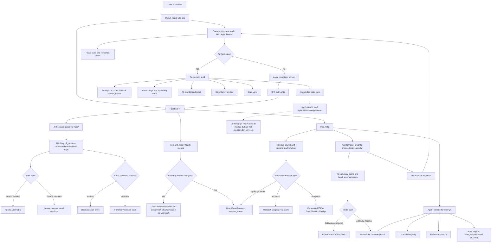
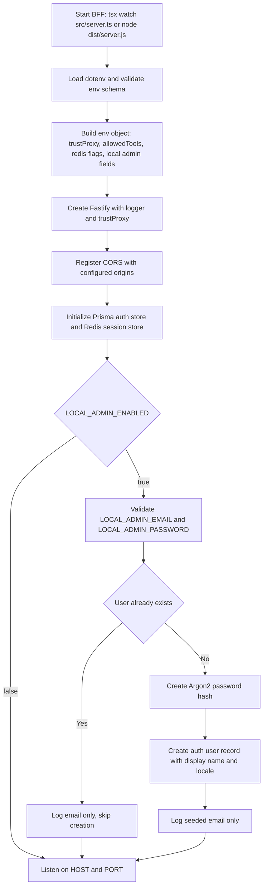
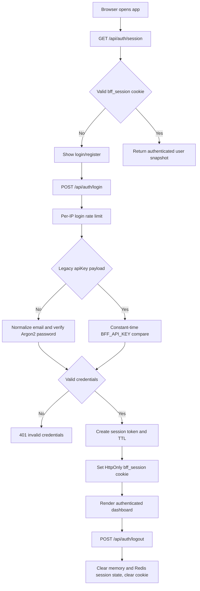
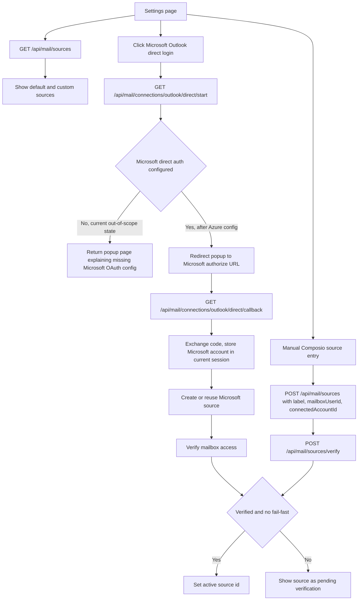
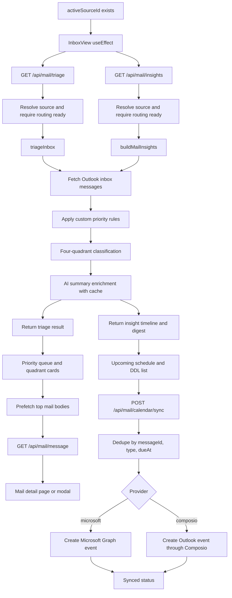
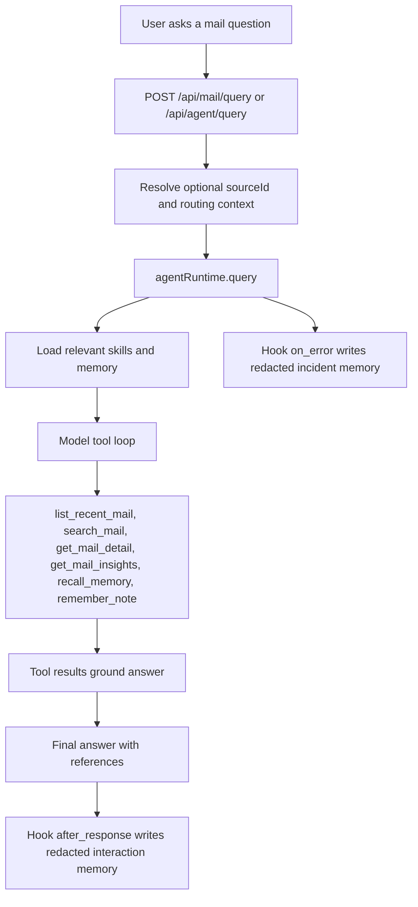
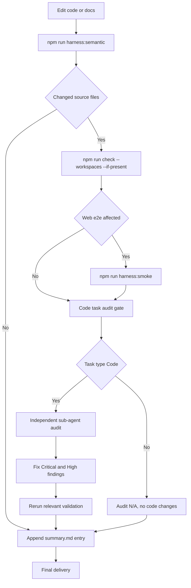

# Current Flowchart And Smoothness Check

Generated at: `2026-04-16T23:06:00+08:00`

Scope:

- Covers the current local code and the recent local-admin seed changes in `apps/bff/src/config.ts` and `apps/bff/src/server.ts`.
- Treats Azure/Microsoft Entra app-registration setup as intentionally out of scope for this pass.
- Evaluates the rest of the runtime flow: WebUI, BFF auth/session, mail-source routing, mail triage/insights/detail, calendar sync, agent runtime, knowledge base surface, and Harness checks.

## 1. Overall Runtime Flow

## 2. Startup And Local Admin Seed Flow

Smoothness notes:

- The new local admin seed path is straightforward and runs before `server.listen`.
- It validates email and password length before writing.
- It does not create a real RBAC admin role. The account is currently an ordinary user with an admin-looking name.
- Do not commit or share audit/log files that contain plaintext local credentials.

## 3. Auth And Session Flow

Smoothness notes:

- The BFF protects all `/api/*` routes except the public auth endpoints through `onRequest`.
- Session status intentionally uses no-store headers.
- Login and register have rate limiting.
- Logout is allowed without an existing valid session so the browser can clean itself up.

## 4. Mail Source Connection Flow

Smoothness notes:

- The Microsoft direct login route is intentionally blocked until Azure/Microsoft Entra values exist.
- Manual Composio source creation requires both `mailboxUserId` and `connectedAccountId`.
- Source selection is guarded: non-ready sources return `412 MAIL_SOURCE_NOT_READY`.

## 5. Main Mail Experience Flow

Smoothness notes:

- The normal mail UI flow is coherent once a ready source exists.
- BFF has timeout-degradation logic for triage and insights: if a large request times out, it retries with a smaller limit.
- Calendar sync has dedupe and stale-entry eviction before re-creating events.
- Current UI does not pass a timezone into `MailContext.fetchInsights`; BFF defaults still work, but user-selected timezone is not fully wired in this path.

## 6. Agent QA And Memory Flow

Smoothness notes:

- The runtime is well separated from the older gateway proxy.
- Mail bodies, skills, and memory are treated as untrusted context in the system prompt.
- Memory writes redact emails, URLs, obvious secret prefixes, and long hex IDs.

## 7. Harness Development And Delivery Flow

Validation run for this pass:

- `npm run harness:semantic`: passed, with 8 existing zod-safe-parse warnings.
- `npm run check --workspaces --if-present`: passed.
- `curl http://127.0.0.1:8787/health`: reachable, returns `503` because direct mode has SiliconFlow configured but Composio and Microsoft direct auth are not configured.
- `curl http://127.0.0.1:5173/`: failed because the WebUI dev server is not currently running.

## 8. Smoothness Verdict

Overall:

- Core BFF startup, local auth, session guard, local admin seed, mail-source state machine, mail triage, mail insights, mail detail, calendar sync, agent QA, and Harness verification are structurally smooth.
- The Azure/Microsoft configuration gap is expected and intentionally excluded from this pass.
- The knowledge base UI path is currently not smooth.
- Local visual end-to-end verification cannot be completed until the WebUI dev server is started again.

Green areas:

- TypeScript check passes across workspaces.
- Harness semantic gate passes.
- BFF health endpoint is reachable and accurately reports missing external dependencies.
- Local admin seed path is clear and isolated behind `LOCAL_ADMIN_ENABLED`.
- `/api/*` session protection is centralized.
- Mail-source activation is guarded by routing verification.
- Mail processing has rate limits, timeout fallback, source isolation, summary cache, and calendar dedupe.

Issues to fix or track:

1. Knowledge base route registration gap.
   - Evidence: `apps/bff/src/routes/knowledge-base.ts` defines `/api/mail-kb/*`, but current `apps/bff/src/server.ts` does not appear to register it.
   - Impact: `KnowledgeBaseView` can call endpoints that the running monolithic server likely does not serve.
   - Suggested fix: wire `registerKnowledgeBaseRoutes(server, deps)` into `server.ts`, or move these handlers into the monolithic route section.

2. Knowledge base response-shape mismatch.
   - Evidence: `registerKnowledgeBaseRoutes` returns `{ ok: true, result: ... }`, while `MailContext.fetchKbStats`, `fetchKbMails`, `fetchKbEvents`, and `fetchKbPersons` read top-level `stats`, `mails`, `events`, and `persons`.
   - Impact: even if routes are registered, the UI may not populate KB data.
   - Suggested fix: normalize `MailContext` to read `data.result.stats`, `data.result.mails`, `data.result.events`, and `data.result.persons`, or change the BFF response contract.

3. Knowledge base trigger/job endpoints are referenced but not found in `server.ts`.
   - Evidence: WebUI calls `/api/mail/knowledge-base/trigger`, `/jobs/:jobId`, and `/jobs/:jobId/stream`.
   - Impact: the summarize modal flow is likely broken unless another server layer registers those routes.
   - Suggested fix: confirm intended module, then register or remove the UI entry until implemented.

4. Timezone parameter is inconsistent.
   - Evidence: BFF expects `tz`; `apps/webui/src/utils/api.ts` sends `timeZone`; `MailContext.fetchInsights` sends neither.
   - Impact: default timezone behavior works, but user-selected timezone is not reliably applied.
   - Suggested fix: use `tz` consistently from UI state through `fetchInsights`, `askMailQuestion`, notification poll, and calendar sync.

5. Provider API base is split.
   - Evidence: `App.tsx` defines `API_BASE` from `VITE_BFF_BASE_URL`, while `AuthProvider` and `MailProvider` default to `/api` and are not passed that value.
   - Impact: same-origin deployments are fine; separate dev/prod BFF origins may silently call the wrong URL.
   - Suggested fix: pass `apiBase={API_BASE}` into `AuthProvider` and `MailProvider`, or remove the unused local helper in `App.tsx`.

6. Local admin is not RBAC.
   - Evidence: auth user view contains id, email, displayName, and locale, but no role.
   - Impact: fine for local access, not a real admin authorization model.
   - Suggested fix: add role/permission only when there are actual admin-only surfaces.

7. Sensitive local credential exposure was found and redacted.
   - Evidence: previous local summary/audit text included the local admin password.
   - Current state: the password is now redacted in `summary.md`, `SUMMARY.md`, and `.harness/audit/2026-04-16-local-deploy-audit.md`.
   - Suggested fix: keep concrete local passwords out of future summaries, audits, screenshots, and PR text.

8. Current WebUI dev server is not running.
   - Evidence: `curl http://127.0.0.1:5173/` cannot connect.
   - Impact: type-level flow is green, but visual browser flow is not currently verifiable.
   - Suggested fix: start `npm run dev:web` when you want browser validation.
